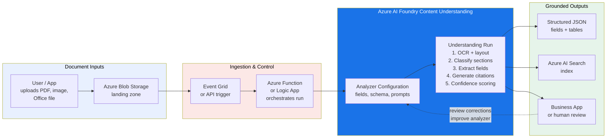

<div align="center">

# Azure AI Foundry - Content Understanding

[](https://www.python.org/downloads/)
[](https://pypi.org/project/azure-ai-contentunderstanding/)
[](LICENSE)

Extract structured data from unstructured documents using Azure AI Foundry Content Understanding.

Includes infrastructure-as-code (Bicep + Terraform), a 2-minute quickstart demo, and progressive walkthrough scripts.

> **Live demo:** [Open Azure AI Foundry Content Understanding](https://ab3y.github.io/AIFondry-ContentUnderstanding/)

[Quickstart](#-quick-start) | [Deploy Infrastructure](#-deploy-infrastructure) | [Demo Walkthrough](#-demo-walkthrough) | [Documentation](#-microsoft-learn-documentation)

</div>

---

## What is Content Understanding?

[Azure AI Foundry Content Understanding](https://learn.microsoft.com/en-us/azure/ai-services/content-understanding/overview) is an Azure AI service that turns unstructured inputs into grounded, machine-readable results. It analyzes documents, images, audio, and video, then returns structured fields, classifications, and generated insights.

**Use it to:**
- Pull business values from invoices, receipts, and contracts
- Identify entities (people, organizations, dates, amounts) in any document
- Classify mixed document sets and route them to the right processor
- Generate markdown ready for search, retrieval, and RAG workflows

The service returns **confidence scores** and **source grounding** so you can decide which results to trust automatically and which need human review.

> **SDK**: `azure-ai-contentunderstanding>=1.1.0` (GA) | **API Version**: `2025-11-01`

## Key Features

| Feature | Description |
|:--------|:------------|
| **Field Extraction** | Pull specific values from documents |
| **Confidence Scores** | 0-1 reliability estimates per field |
| **Source Grounding** | Trace values back to document location |
| **Markdown Conversion** | Structured markdown for RAG/search |
| **Multi-format Support** | PDF, DOCX, XLSX, PPTX, images, audio, video |

## Architecture

> Full interactive diagram: [`Architecture Diagram/AICU-2026-04-21-2105.excalidraw`](Architecture%20Diagram/AICU-2026-04-21-2105.excalidraw) (open with [excalidraw.com](https://excalidraw.com))



## Project Structure

```
.
├── quickstart/              # Run your first demo in 2 minutes
│   ├── demo.py              #   Standalone invoice analyzer with rich output
│   ├── requirements.txt
│   └── README.md
│
├── demos/                   # Progressive 3-step walkthrough
│   ├── 01_prebuilt_analyzer.py       # Step 1: Prebuilt invoice/receipt extraction
│   ├── 02_custom_entity_extractor.py # Step 2: Custom entities + AI summaries
│   ├── 03_multi_document_pipeline.py # Step 3: Classification routing + batch
│   ├── requirements.txt
│   └── README.md
│
├── infra/                   # Infrastructure-as-Code
│   ├── bicep/               #   Azure Bicep templates
│   │   ├── main.bicep
│   │   └── main.bicepparam
│   ├── terraform/           #   Terraform configuration
│   │   ├── main.tf
│   │   ├── variables.tf
│   │   └── outputs.tf
│   └── README.md
│
├── data/                    # Sample documents (add your own)
├── .env.template            # Environment variable template
├── CU-Model-Explanation.md  # Why each AI model is needed
└── README.md                # You are here
```

| Document | Description |
|:---------|:------------|
| [`quickstart/README.md`](quickstart/README.md) | 2-minute quickstart guide |
| [`quickstart/demo.py`](quickstart/demo.py) | Standalone invoice analyzer with rich colored output |
| [`demos/README.md`](demos/README.md) | Progressive 3-step walkthrough guide |
| [`infra/README.md`](infra/README.md) | Bicep and Terraform deployment instructions |
| [`CU-Model-Explanation.md`](CU-Model-Explanation.md) | Why each AI model (gpt-4.1, gpt-4.1-mini, text-embedding-3-large) is needed |
| [`.env.template`](.env.template) | Environment variable template - copy to `.env` |
| [`LICENSE`](LICENSE) | MIT License |
| [`Architecture Diagram`](Architecture%20Diagram/AICU-2026-04-21-2105.excalidraw) | Full interactive architecture diagram (Excalidraw) |

## Prerequisites

Before you begin, make sure you have:

1. **Azure subscription** - [Create a free account](https://azure.microsoft.com/pricing/purchase-options/azure-account)
2. **Azure AI Foundry resource** (`kind: AIServices`) - Deploy via [`infra/`](infra/README.md) or [manually in Azure Portal](https://portal.azure.com/#create/Microsoft.CognitiveServicesAIFoundry)
3. **Model deployments** - The following models must be deployed on your resource:

   | Model | Purpose |
   |:------|:--------|
   | `gpt-4.1` | Completion model for summaries, classification, complex extraction |
   | `gpt-4.1-mini` | Lightweight model for confidence scoring and simple tasks |
   | `text-embedding-3-large` | Embedding model for semantic matching and field alignment |

   > See [`CU-Model-Explanation.md`](CU-Model-Explanation.md) for a detailed breakdown of why each model is needed.

4. **Python 3.9+** - [Download here](https://www.python.org/downloads/)

## ⚡ Quick Start

Get a working demo in 2 minutes. See [`quickstart/README.md`](quickstart/README.md) for full details.

```bash
# 1. Install dependencies
pip install -r quickstart/requirements.txt

# 2. Configure your environment
cp .env.template .env
# Edit .env with your endpoint and key (or leave key blank for az login auth)

# 3. Run the demo
python quickstart/demo.py
```

> **Note**: If your Azure resource has API keys disabled (`disableLocalAuth=true`), leave `CONTENTUNDERSTANDING_KEY` blank in `.env` and authenticate with `az login` instead. The scripts automatically fall back to `DefaultAzureCredential`.

<details>
<summary><strong>Example output</strong> (click to expand)</summary>

```
╭────────────────────────────╮
│ Content Understanding Demo │
╰────────────────────────────╯
Analyzer: prebuilt-invoice
Source: https://...azure.../invoice.pdf

                    Extracted Fields
┏━━━━━━━━━━━━━━━━┳━━━━━━━━━━━━━━━━━━┳━━━━━━━━━━━━┓
┃ Field          ┃ Value            ┃ Confidence ┃
┡━━━━━━━━━━━━━━━━╇━━━━━━━━━━━━━━━━━━╇━━━━━━━━━━━━┩
│ Vendor Name    │ CONTOSO LTD.     │       0.58 │
│ Invoice Number │ INV-100          │       0.80 │
│ Invoice Date   │ 2019-11-15       │       0.96 │
│ Due Date       │ 2019-12-15       │       0.96 │
│ Invoice Total  │ $110.00 USD      │        n/a │
│ Amount Due     │ $610.00 USD      │        n/a │
│ Line Items     │ 3 items          │        n/a │
└────────────────┴──────────────────┴────────────┘
```

</details>

You can also analyze your own documents:

```bash
# Analyze a local file
python quickstart/demo.py .\data\my-receipt.png

# Analyze from a URL
python quickstart/demo.py https://example.com/invoice.pdf
```

## 🏗 Deploy Infrastructure

The [`infra/`](infra/README.md) folder has Bicep and Terraform templates to provision the Azure AI Services resource.

<details>
<summary><strong>Option A: Deploy with Bicep</strong></summary>

```bash
az group create --name rg-content-understanding --location eastus

az deployment group create \
  --resource-group rg-content-understanding \
  --template-file infra/bicep/main.bicep \
  --parameters resourceName=<your-resource-name>
```

</details>

<details>
<summary><strong>Option B: Deploy with Terraform</strong></summary>

```bash
cd infra/terraform
terraform init
terraform plan -var="resource_name=<your-resource-name>"
terraform apply -var="resource_name=<your-resource-name>"
```

</details>

After deploying, configure model deployments and set your `.env`. See [`infra/README.md`](infra/README.md) for full post-deployment steps.

## 🎓 Demo Walkthrough

The [`demos/`](demos/README.md) folder expands the quickstart into a progressive three-step walkthrough:

| Step | Script | What It Demonstrates |
|:-----|:-------|:---------------------|
| 1 | [`01_prebuilt_analyzer.py`](demos/01_prebuilt_analyzer.py) | Built-in invoice/receipt extraction with zero config |
| 2 | [`02_custom_entity_extractor.py`](demos/02_custom_entity_extractor.py) | Custom entity extraction + AI-generated summaries |
| 3 | [`03_multi_document_pipeline.py`](demos/03_multi_document_pipeline.py) | Document classification, routing, and batch processing |

```bash
cd demos
pip install -r requirements.txt
python 01_prebuilt_analyzer.py
```

## Extraction Methods

Content Understanding supports three field extraction methods:

| Method | Description | Example Use Cases |
|:-------|:------------|:------------------|
| `extract` | Pull literal values exactly as they appear in the document | Invoice numbers, dates, amounts, addresses |
| `generate` | AI-generated values derived from document content | Summaries, insights, key terms |
| `classify` | Categorize content from a predefined set of values | Document type, sentiment, priority level |

## Confidence Scores

Every extracted field includes a confidence score (0.0 - 1.0):

| Score Range | Indicator | Recommended Action |
|:------------|:----------|:-------------------|
| > 0.85 | ✅ High | Auto-approve |
| 0.50 - 0.85 | ⚠️ Medium | Flag for human review |
| < 0.50 | ❌ Low | Reject or re-process |

## Supported Input Formats

| Category | Formats | Max Size |
|:---------|:--------|:---------|
| Documents | PDF, DOCX, XLSX, PPTX, HTML, TXT, CSV, MD, RTF | 200 MB |
| Images | JPEG, PNG, BMP, TIFF, HEIF/HEIC | 200 MB |
| Audio | WAV, MP3, MP4, OPUS, OGG, FLAC, WMA, AAC | 300 MB |
| Video | MP4, AVI, MKV, MOV, WMV, FLV | 200 MB (direct) / 4 GB (URL) |

## Supported Regions

`eastus` | `eastus2` | `westus` | `westus3` | `westeurope` | `northeurope` | `swedencentral` | `uksouth` | `southcentralus` | `southeastasia` | `australiaeast` | `japaneast`

## 📚 Microsoft Learn Documentation

| Resource | Description |
|:---------|:------------|
| [Content Understanding Overview](https://learn.microsoft.com/en-us/azure/ai-services/content-understanding/overview) | Service overview and key concepts |
| [What's New](https://learn.microsoft.com/en-us/azure/ai-services/content-understanding/whats-new) | Latest features and updates |
| [Quickstart (REST API)](https://learn.microsoft.com/en-us/azure/ai-services/content-understanding/quickstart/use-rest-api) | Get started with the REST API |
| [Prebuilt Analyzers](https://learn.microsoft.com/en-us/azure/ai-services/content-understanding/concepts/prebuilt-analyzers) | Invoice, receipt, layout, and more |
| [Analyzer Reference](https://learn.microsoft.com/en-us/azure/ai-services/content-understanding/concepts/analyzer-reference) | Field schemas and extraction methods |
| [Custom Analyzer Tutorial](https://learn.microsoft.com/en-us/azure/ai-services/content-understanding/tutorial/create-custom-analyzer) | Build your own analyzer |
| [Service Limits](https://learn.microsoft.com/en-us/azure/ai-services/content-understanding/service-limits) | File size limits and quotas |
| [Language & Region Support](https://learn.microsoft.com/en-us/azure/ai-services/content-understanding/language-region-support) | Supported languages and regions |
| [REST API Reference](https://learn.microsoft.com/en-us/rest/api/contentunderstanding/content-analyzers?view=rest-contentunderstanding-2025-11-01) | Full API specification |
| [Python SDK (PyPI)](https://pypi.org/project/azure-ai-contentunderstanding/) | Install the Python SDK |
| [Python SDK Reference](https://learn.microsoft.com/en-us/python/api/overview/azure/ai-contentunderstanding-readme) | SDK classes and methods |
| [SDK Samples (GitHub)](https://github.com/Azure/azure-sdk-for-python/tree/main/sdk/contentunderstanding/azure-ai-contentunderstanding/samples) | Official code samples |
| [Pricing](https://azure.microsoft.com/en-us/pricing/details/content-understanding/) | Pay-as-you-go pricing details |
| [ARM/Bicep Template Reference](https://learn.microsoft.com/en-us/azure/templates/microsoft.cognitiveservices/accounts) | Infrastructure template docs |

## Contributing

Contributions are welcome! Please open an issue or submit a pull request.

## License

This project is licensed under the [MIT License](LICENSE).
